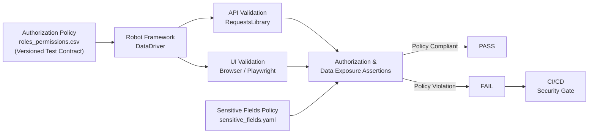

# Role-Based Access Control (RBAC) Security Gate

A policy-driven security regression framework that validates RBAC authorization and restricted data exposure across API and UI layers, with deterministic CI/CD security-gate scenarios.

## 🎯 What This Project Does

This framework automates security validations by enforcing a defined Role-Based Access Control (RBAC) matrix. It acts as a CI/CD **Security Gate** that prevents subsequent deployment stages from executing when the security gate fails due to authorization violations or unauthorized exposure of sensitive data in either the backend (API) or frontend (UI).

## 🛡️ Security Validation Model

The framework separates identity/session handling from authorization decisions and subsequent restricted-data exposure checks. The validation flow follows a strict model:

1. **Authentication**: Identity resolution and session initialization.
2. **Authorization**: Determining if the identity is permitted to access the logical resource.
3. **Resource Access**: Requesting the endpoint or navigating the UI route.
4. **Data Exposure**: Verifying if restricted data is inappropriately exposed during the access attempt.

For API validation, the model expects:
- **Unauthenticated**: HTTP `401` + restricted data absent.
- **Authenticated but unauthorized (`deny`)**: HTTP `403` + restricted data absent.
- **Authorized (`allow`)**: HTTP `200` + expected allowed fields + unauthorized sensitive fields absent.

## 📋 Policy-as-Data

Security rules are decoupled from test execution code. 

**`roles_permissions.csv`** defines the authorization policy: who can perform which action on which logical resource, and what outcome is expected:
```csv
role,resource,action,expected_status,layer,security_rule
employee,salary_info,read,403,api,deny
admin,salary_info,read,200,api,allow
```

**`sensitive_fields.yaml`** defines *what* is sensitive (e.g., `ssn`, `salary`).
A sensitive field is not inherently unauthorized; exposure becomes a violation only when it falls outside the applicable authorization policy.

The framework turns these version-controlled RBAC policies into executable security tests via `DataDriver`.

## 🔍 Discovery-First Test Contract

The framework utilizes a Discovery-First approach to establish a reliable baseline:

```text
Application Discovery → Observed roles / UI routes / API endpoints → Authorization Policy Matrix → Versioned Test Contract
```

CI/CD does not dynamically rediscover the application. It deterministically validates the versioned authorization contract established during the discovery phase.

## 🏗️ Architecture



## 🧪 What Is Tested

### API Authorization
Verifies that unauthorized roles receive the expected authorization response, such as `403 Forbidden`, when accessing restricted API resources (e.g., salary-related resources), and asserts that sensitive payload fields are strictly absent upon rejection.

### UI Authorization
Navigates protected UI routes (e.g., Admin Panel) to ensure that unauthorized roles cannot view restricted content. It validates that sensitive elements are not present in the DOM (Note: `Visible UI ≠ DOM Exposure`. We inspect the relevant DOM content, not only visible UI elements).

### Restricted Data Exposure
Validates the presence or absence of data keys listed in the Sensitive Fields Policy against the resulting API payloads and relevant DOM content, based on the current authorization rule.

### Cross-Layer Data-Driven Execution
The suite dynamically delegates policy validation to either the UI or API layer, orchestrated entirely by the CSV matrix. Resources in the matrix represent **business-level logical resources** rather than raw technical endpoints, keeping security policy decoupled from implementation details.

## 🎭 Execution Modes

**External Environment**
- Target application (e.g., OrangeHRM).
- Validates the established authorization contract using the target application's actual authentication/session mechanisms.

**Mock / Demonstration Environment**
- Deterministic and reproducible demonstration mode.
- Avoids external credentials/dependencies.
- By default, it provides a deterministic environment in which the defined authorization policy is satisfied, allowing the full suite to execute reproducibly.
- Supports controlled security-failure simulation.

## 🚨 Controlled Authorization Regression

To demonstrate the CI/CD pipeline capabilities, the framework includes a mechanism to inject a controlled authorization regression.

```text
Expected Policy: employee → salary_info → DENY
        ↓
Simulated Bug: employee → salary_info → ALLOW (Backend returns HTTP 200)
        ↓
Security Assertion: FAIL (Security Policy Violation)
        ↓
GitHub Actions: Security Gate Blocked
```

The failed security gate prevents subsequent deployment stages from executing.

## 🧱 Project Structure

```text
├── .github/workflows/
│   └── security-regression.yml   # CI/CD Security Gate pipeline
├── config/
│   ├── env_config.py             # Environment configuration & Mock toggles
│   └── sensitive_fields.yaml     # Policy definition of restricted data
├── data/
│   └── roles_permissions.csv     # Executable Authorization Policy
├── resources/
│   ├── api_authorization_keywords.resource  # RequestsLibrary implementations
│   ├── auth_keywords.resource               # Core authentication/session logic
│   └── ui_authorization_keywords.resource   # Playwright UI implementations
├── results/                      # Generated Robot Framework artifacts
├── tests/
│   ├── api/                      # Isolated API test scenarios
│   ├── authorization/
│   │   └── permissions_matrix.robot # Cross-layer Data-Driven suite
│   └── ui/                       # Isolated UI test scenarios
├── requirements.txt              # Python dependencies
├── robot.yaml                    # Robot Framework project configuration
└── README.md
```

## 🛠️ Tech Stack
- **Core Framework**: Robot Framework (Python)
- **Data Orchestration**: robotframework-datadriver
- **UI Automation**: robotframework-browser (Playwright)
- **API Automation**: robotframework-requests

## 📊 Framework Output
Upon completion, the framework produces:
- **Interactive HTML Report**: Step-by-step breakdown of validations (`log.html` & `report.html`).
- **Security Audit Output**: Clear, professional exception handling (e.g., `Security Policy Violation: Expected HTTP 403...`) rather than raw infrastructure timeouts.

## 🚀 How to Run

1. **Clone and Install**
```bash
git clone https://github.com/your-username/access-control-test-automation.git
cd access-control-test-automation
python -m venv .venv
source .venv/bin/activate  # On Windows use: .venv\Scripts\activate
pip install -r requirements.txt
```

2. **Initialize Playwright Dependencies**
```bash
rfbrowser init
```

3. **Execute Deterministic Demonstration Mode**
```bash
robot -d results tests/
```

4. **Execute Controlled Security Failure**
`SIMULATE_SECURITY_INCIDENT` enables the controlled authorization regression scenario:
```bash
robot -v SIMULATE_SECURITY_INCIDENT:True -d results tests/
# Expected result: security gate failure
```

## 🔒 Scope & Boundaries

**In scope**
- RBAC validation
- Authorization regression testing
- API/UI authorization consistency
- Restricted data exposure
- Policy-driven testing
- CI/CD quality gating

**Out of scope**
- Penetration testing
- Vulnerability scanning
- Fuzzing
- Infrastructure security testing
- Network security testing
- Full GDPR compliance auditing
